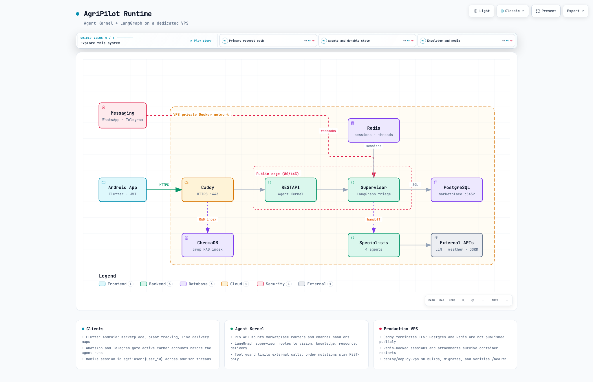

<p align="center">
  
</p>

<h1 align="center">AgriPilot</h1>

<p align="center">
  <strong>From crop diagnosis to doorstep delivery — an agentic platform for farmers, buyers, and riders</strong>
</p>

<p align="center">
  AI advisory · Farmer marketplace · Live order tracking · Android, WhatsApp &amp; Telegram
</p>

<p align="center">
  <a href="https://github.com/yaalalabs/agent-kernel/releases?q=agripilot-mobile"></a>
  <a href="https://www.python.org/"></a>
  <a href="https://github.com/yaalalabs/agent-kernel"></a>
  <a href="https://langchain-ai.github.io/langgraph/"></a>
  <a href="https://flutter.dev/"></a>
</p>

<p align="center">
  <a href="https://github.com/yaalalabs/agent-kernel/releases?q=agripilot-mobile"><strong>Download Android APK</strong></a>
  &nbsp;·&nbsp;
  <a href="#quick-start">Quick start</a>
  &nbsp;·&nbsp;
  <a href="#features">Features</a>
  &nbsp;·&nbsp;
  <a href="#production-vps-deployment">VPS deploy</a>
  &nbsp;·&nbsp;
  <a href="use-cases/agri-pilot/docs/architecture/agripilot.architecture.html">Architecture</a>
  &nbsp;·&nbsp;
  <a href="use-cases/agri-pilot/mobile/README.md">Mobile dev</a>
</p>

<p align="center">
  <em>Built with <a href="docs/AGENT_KERNEL_README.md">Agent Kernel</a> · <a href="https://kernel.yaala.ai/docs">Framework docs</a></em>
</p>

---

AgriPilot helps farmers diagnose crop problems, manage sell listings and plant health, connect with buyers, and coordinate rider delivery — with an AI advisor on **Android**, **WhatsApp**, and **Telegram**. The backend is a [Agent Kernel](https://github.com/yaalalabs/agent-kernel) use-case using **LangGraph** multi-agent routing, a **Postgres** marketplace, and **Redis**-backed durable sessions.

[`AGENTS.md`](use-cases/agri-pilot/AGENTS.md) covers conventions for coding agents working in `use-cases/agri-pilot/`.

## Download the Android app

Release APKs are published as **draft** [GitHub Releases](https://github.com/yaalalabs/agent-kernel/releases?q=agripilot-mobile) by [`agripilot-mobile-release`](.github/workflows/agripilot-mobile-release.yaml).

| Step | Action |
|------|--------|
| 1 | Download the latest `agripilot-*.apk` from [Releases](https://github.com/yaalalabs/agent-kernel/releases?q=agripilot-mobile) |
| 2 | On your phone, allow install from your browser or files app |
| 3 | Open the APK — the app talks to the production API baked in at build time |

**Maintainers:** deploy the backend on a VPS (below), then run **Actions → AgriPilot Mobile Release**:

| Input | Example | Notes |
|-------|---------|-------|
| `version` | `1.0.1` or `1.0.1+12` | Baked into the APK; does not modify `pubspec.yaml` |
| `api_base_url` | `https://agripilot.knurdz.org` | Optional; defaults to production |

The workflow runs tests, builds the APK, generates grouped release notes from mobile commits, and opens a **draft** release tagged `agripilot-mobile-v<version>`. Edit the notes on GitHub, then publish when ready.

> Mobile release tags use the `agripilot-mobile-v*` prefix — separate from Agent Kernel PyPI publish tags (`v*`).

---

## Features

### AI Advisor (all roles)

| Capability | Details |
|------------|---------|
| **Crop diagnosis** | Photo-based disease detection (HuggingFace ViT) with quality checks and confidence threshold |
| **Treatment advice** | Agricultural RAG over ChromaDB (`data/chroma_db/`) with chemical/dosage safety validation |
| **Weather & irrigation** | Open-Meteo forecasts — no API key required |
| **Conversation memory** | Redis-backed sessions, case history, follow-up resolution (“it’s getting worse”) |
| **Thread history** | Mobile chat threads via Agent Kernel thread routes |
| **Safety backstops** | Supervisor handoff-loop guard + knowledge-agent treatment validation |

The agent **explains** marketplace and delivery status but **never** creates orders, assigns riders, or mutates order state — those actions are REST-only in the mobile app.

### Farmer

- **Sell listings** — crop, quantity, price, category, description, harvest date, product photo, analytics (views, connections, revenue)
- **Plant tracking** — tracked plants with photo timeline and derived insights
- **Quick crop scan** — one-time ViT analysis without creating a plant
- **Import plant to listing** — link tracked crop health to a sell listing for buyers
- **Orders** — confirm quantity, mark ready, live tracking map
- **Channels** — link WhatsApp or Telegram for advisor chat outside the app

### Buyer

- **Browse & match** — filter listings by crop, district, category, quantity, price; ranked match API
- **Crop-health insights** — observation counts and diagnosis timeline on listings linked to tracked plants (no raw photos or chemical advice)
- **Connections** — express interest; phone numbers revealed only after acceptance
- **Checkout** — pickup or rider delivery; live order tracking with map, ETA, and rider GPS

### Rider

- **Self-register** with vehicle confirmation
- **Go online** + share GPS to see nearby delivery jobs (weight + distance)
- **Accept jobs** in the app; one active delivery at a time
- **Live tracking** — post GPS every few seconds; OSM map tiles (no Google Maps API key)
- **PIN handoff** — enter buyer PIN on the Deliveries tab at drop-off

Payment is **cash/off-platform**. Maps use **OpenStreetMap** in the app and optional **OSRM** road routing on the server.

---

## Architecture

<p align="center">
  <a href="use-cases/agri-pilot/docs/architecture/agripilot.architecture.html">
    
  </a>
</p>

<p align="center"><em>Click for the interactive diagram (Archify). Source: <code>use-cases/agri-pilot/docs/architecture/agripilot.architecture.json</code></em></p>

**Runtime flow**

1. **Clients** — Flutter Android (JWT), WhatsApp Cloud API, Telegram Bot API
2. **Edge** — Caddy terminates HTTPS (Let’s Encrypt) on the VPS; only ports 80/443 are public
3. **App** — Agent Kernel `RESTAPI` serves marketplace REST, authenticated mobile chat, and channel webhooks
4. **Agents** — LangGraph supervisor routes to `vision`, `knowledge`, `resource`, and `delivery` specialists
5. **Data** — PostgreSQL (marketplace/orders), Redis (sessions, attachments, threads), ChromaDB (RAG), on-disk plant/listing media

Supervisor routing lives in [`use-cases/agri-pilot/agents/supervisor.py`](use-cases/agri-pilot/agents/supervisor.py). Marketplace order/dispatch logic is deterministic REST in `use-cases/agri-pilot/marketplace/order_service.py`, `dispatch_service.py`, and `tracking_service.py`.

---

## How Agent Kernel is used

AgriPilot is an end-to-end use-case built **on top of** Agent Kernel — not a fork of the framework.

### Package and extras

```toml
agentkernel[cli,langgraph,multimodal,chromadb,openai,api,whatsapp,telegram,redis,thread]>=0.8.1
```

Defined in [`pyproject.toml`](use-cases/agri-pilot/pyproject.toml). Production Docker reinstalls monorepo `ak-py` because PyPI `0.8.1` predates `auth.authoriser` and mobile thread routes — see [`deploy/Dockerfile`](use-cases/agri-pilot/deploy/Dockerfile).

### Entry points

| File | Role |
|------|------|
| [`demo.py`](use-cases/agri-pilot/demo.py) | CLI — `LangGraphModule([triage_agent])` for local testing |
| [`app.py`](use-cases/agri-pilot/app.py) | Production — REST + WhatsApp + Telegram + marketplace routers |

`app.py` wiring:

```python
LangGraphModule([triage_agent])

RESTAPI.add(auth_router)       # /api/auth, /api/farmer, /api/buyer, …
RESTAPI.add(farmer_router)
# … marketplace routers …

RESTAPI.run([
    AuthenticatedMobileChatHandler(),  # JWT + thread history
    FastAckWhatsAppHandler(),
    GatedTelegramHandler(),
])
```

### Multi-agent graph

- **Supervisor** (`use-cases/agri-pilot/agents/supervisor.py`) — `langgraph_supervisor` triage with 20+ tools (marketplace, delivery, plan, profile)
- **Vision** — ViT crop diagnosis from multimodal attachments
- **Knowledge** — ChromaDB RAG + `validate_treatment` safety gate
- **Resource** — Open-Meteo weather, irrigation, spray timing
- **Delivery** — read-only order/dispatch explanations

Tools are wrapped with `@guarded` (`use-cases/agri-pilot/tools/tool_guard.py`) — per-session call limits and timeouts.

### Sessions and identity

| Channel | Session key | Notes |
|---------|-------------|-------|
| Mobile | `agri:user:{user_id}` | JWT via `AuthenticatedMobileChatHandler` + `MarketplaceJwtAuthoriser` |
| WhatsApp | Sender `wa_id` (E.164) | Farmer + active subscription gate |
| Telegram | `chat_id` | Linked via contact-share to `users.telegram_chat_id` |

Config in [`config.yaml`](use-cases/agri-pilot/config.yaml); override with `AK_*` env vars (`AK_SESSION__TYPE=redis`, etc.). Docker and VPS use Redis for sessions, multimodal attachments, and conversation threads.

### Guardrails

- OpenAI moderation/jailbreak via `guardrails_input.json` / `guardrails_output.json`
- Code-level backstops: `agents/supervisor_guardrails.py`, `agents/knowledge_guardrails.py`
- WhatsApp/Telegram hard gates block non-farmer or inactive accounts before any LLM call

---

## Quick start

### Prerequisites

- Python `>=3.12`, [`uv`](https://github.com/astral-sh/uv)
- One LLM key: `OPENAI_API_KEY`, `GEMINI_API_KEY`, or `OPENROUTER_API_KEY`
- For production channels: WhatsApp and/or Telegram credentials (see below)
- For marketplace JWT: `AK_MARKETPLACE__JWT_SECRET` (≥32 chars in prod)

### Local backend (Docker)

```bash
cd use-cases/agri-pilot
cp .env.local.example .env.local   # fill at least one LLM key
./build.sh
docker compose up --build          # Postgres + Redis + API on :8000
curl http://localhost:8000/health  # {"status":"ok"}
```

### Local backend (bare metal)

```bash
cd use-cases/agri-pilot
cp .env.local.example .env.local
./build.sh
uv run python app.py               # needs Postgres for marketplace
# or CLI only:
python demo.py
```

### Tests

```bash
OPENAI_API_KEY=sk-dummy uv run pytest -m "not slow"
```

Run from `use-cases/agri-pilot/` — repo-root pytest collects the whole monorepo.

### Android app (dev)

```bash
cd use-cases/agri-pilot/mobile
flutter pub get
flutter run --dart-define=API_BASE_URL=http://10.0.2.2:8000   # emulator → host Docker
```

See [`use-cases/agri-pilot/mobile/README.md`](use-cases/agri-pilot/mobile/README.md) for Firebase push (optional) and physical-device LAN URLs.

---

## Production VPS deployment

Production stack: **Caddy** (automatic HTTPS) → **app** (Agent Kernel REST + agent runner) → **Postgres 16** + **Redis 7** on a private Docker network. Only Caddy is public.

### Prerequisites

- Ubuntu 22.04 or 24.04 VPS with SSH
- DNS `A`/`AAAA` for your domain pointing at the VPS **before** first deploy
- Firewall: inbound **22**, **80**, **443** only
- Meta WhatsApp Cloud API + Telegram bot credentials (if using channels)
- One LLM provider API key

### One-command deploy (fresh VPS)

```bash
export REPO_URL=https://github.com/yaalalabs/agent-kernel.git
export BRANCH=main
export INSTALL_DIR=/opt/agent-kernel

curl -fsSL https://raw.githubusercontent.com/yaalalabs/agent-kernel/main/use-cases/agri-pilot/deploy/deploy-vps.sh \
  | bash -s -- setup

# Edit deploy/.env.production on the server, then:
bash /opt/agent-kernel/use-cases/agri-pilot/deploy/deploy-vps.sh deploy
```

Or clone first:

```bash
git clone --branch main https://github.com/yaalalabs/agent-kernel.git /opt/agent-kernel
cd /opt/agent-kernel/use-cases/agri-pilot
cp deploy/.env.production.example deploy/.env.production
chmod 600 deploy/.env.production
# fill DOMAIN, LLM, WhatsApp, Telegram, and strong secrets
./deploy/deploy-vps.sh deploy
```

First `./deploy/deploy-vps.sh setup` generates strong JWT/Postgres/WhatsApp-verify/Telegram-webhook secrets into `deploy/.env.production` (mode `600`). The script never prints secret values and never overwrites an existing populated env file.

### Update workflow

```bash
cd /opt/agent-kernel/use-cases/agri-pilot
git pull --ff-only origin main
./deploy/deploy-vps.sh update
```

`update` rebuilds the app image, runs `alembic upgrade head`, and probes `https://<DOMAIN>/health`. Named volumes (Postgres, Redis, Caddy certs, Chroma cache, plant-media, listing-media) are retained.

Without git on the server:

```bash
DEPLOY_SKIP_GIT=1 ./deploy/deploy-vps.sh update
```

After deploy, trigger **Actions → AgriPilot Mobile Release** with your version and API URL, or build locally:

```bash
cd use-cases/agri-pilot/mobile
flutter build apk --release --dart-define=API_BASE_URL=https://<DOMAIN>
```

### Operations

| Command | Purpose |
|---------|---------|
| `./deploy/deploy-vps.sh deploy` | Full deploy (build, migrate, start, verify) |
| `./deploy/deploy-vps.sh update` | Same as deploy |
| `./deploy/deploy-vps.sh status` | Container status + public `/health` probe |
| `./deploy/deploy-vps.sh logs [service]` | Follow logs (`db`, `redis`, `app`, `caddy`, …) |
| `./deploy/deploy-vps.sh restart` | Restart app + Caddy |
| `./deploy/deploy-vps.sh backup` | Timestamped Postgres dump under `deploy/backups/` |
| `./deploy/deploy-vps.sh restore <file.sql.gz>` | Destructive DB restore (requires typing `restore`) |
| `./deploy/validate-deploy.sh` | Compose config validation |
| `./deploy/validate-deploy.sh --smoke` | Local build + migration + `/health` without Caddy |

### Webhooks

After deploy, the script registers Telegram (`https://<DOMAIN>/telegram/webhook`). WhatsApp Meta console (manual):

- Callback URL: `https://<DOMAIN>/whatsapp/webhook`
- Verify token: `AK_WHATSAPP__VERIFY_TOKEN`
- Subscribe to `messages`

### Deploy files

| Path | Role |
|------|------|
| [`deploy/docker-compose.vps.yml`](use-cases/agri-pilot/deploy/docker-compose.vps.yml) | Production Compose stack |
| [`deploy/Caddyfile`](use-cases/agri-pilot/deploy/Caddyfile) | Automatic HTTPS reverse proxy |
| [`deploy/Dockerfile`](use-cases/agri-pilot/deploy/Dockerfile) | Hardened app image (non-root, baked knowledge ingest) |
| [`deploy/.env.production.example`](use-cases/agri-pilot/deploy/.env.production.example) | Documented env template |
| [`deploy/deploy-vps.sh`](use-cases/agri-pilot/deploy/deploy-vps.sh) | Idempotent deploy + operations |

---

## Configuration

`demo.py` calls `load_dotenv(".env.local")` **before** importing `agentkernel` — keep that order in new entrypoints. `AK_` env vars override `config.yaml` with `__` nesting.

Key knobs (see [`.env.local.example`](use-cases/agri-pilot/.env.local.example)):

| Var | Purpose |
|-----|---------|
| `AK_MARKETPLACE__DATABASE_URL` | `postgresql+psycopg://...` (compose wires `db` service) |
| `AK_SESSION__TYPE` / `AK_SESSION__REDIS__URL` | Redis session store (compose sets `redis`) |
| `AK_MULTIMODAL__STORAGE_TYPE` / `AK_MULTIMODAL__REDIS__URL` | Redis attachment storage |
| `AK_THREAD__TYPE` / `AK_THREAD__REDIS__URL` | Conversation thread store (mobile history) |
| `AK_MARKETPLACE__JWT_SECRET` | HS256 secret (≥32 chars in prod) |
| `AK_WHATSAPP__*` / `AK_TELEGRAM__*` | Messaging channel credentials |
| `AGRIPILOT_TOOL_MAX_CALLS` / `AGRIPILOT_TOOL_TIMEOUT_SECONDS` | Tool guard limits |
| `AGRIPILOT_PLANT_MEDIA_ROOT` / `AGRIPILOT_LISTING_MEDIA_ROOT` | On-disk media roots |

---

## Marketplace roles & auth

- **Roles:** `farmer` (sells, WhatsApp+REST), `buyer` (JWT-only browse/connect), `rider` (delivery), `admin` via `scripts/seed_admin.py`
- **Phone:** E.164 `^\+[1-9]\d{7,14}$`
- **JWT:** `Authorization: Bearer <token>` on protected routes
- **Subscription:** Farmer `active` required for `/api/farmer/*`; WhatsApp/Telegram gate matches

### Quickstart (curl)

```bash
BASE=http://localhost:8000

# Farmer signup + login
curl -s $BASE/api/auth/signup -H 'Content-Type: application/json' \
  -d '{"role":"farmer","phone_number":"+94770000001","password":"secret123","name":"Amal","district":"Kandy"}'
curl -s $BASE/api/auth/login -H 'Content-Type: application/json' \
  -d '{"phone_number":"+94770000001","password":"secret123"}'
F_TOKEN=<jwt>

# Buyer signup + login
curl -s $BASE/api/auth/signup -H 'Content-Type: application/json' \
  -d '{"role":"buyer","phone_number":"+94770000002","password":"secret123","name":"Nimal","district":"Colombo"}'
B_TOKEN=<jwt from login>

# Farmer listing
curl -s $BASE/api/farmer/listings -H "Authorization: Bearer $F_TOKEN" \
  -H 'Content-Type: application/json' \
  -d '{"crop":"tomato","quantity_kg":500,"price_per_kg":120}'
```

---

## API reference

### Agent Kernel defaults

| Method | Path | Auth | Notes |
|--------|------|------|-------|
| `GET` | `/health` | none | `{"status":"ok"}` |
| `GET` | `/openapi.json`, `/docs`, `/redoc` | none | FastAPI docs |
| `GET` | `/api/v1/agents` | none | list (`triage`) |
| `POST` | `/api/v1/chat` | JWT (mobile) / none (dev) | `{"prompt","session_id","agent":"triage"}` |
| `POST` | `/api/v1/chat-multipart` | JWT (mobile) | multipart photos (10 MB limit) |
| `GET` | `/api/v1/threads*` | JWT | Mobile chat history |
| `GET` | `/whatsapp/webhook?hub.*` | verify token | Meta challenge |
| `POST` | `/whatsapp/webhook` | signature + farmer gate | fast-ack |
| `POST` | `/telegram/webhook` | secret token + farmer gate | fast-ack |

### Mobile API surfaces

| Method | Path | Auth |
|--------|------|------|
| `PATCH` | `/api/auth/me` | JWT |
| `GET` | `/api/auth/me/channels` | JWT |
| `POST` | `/api/auth/me/channels/telegram/link-token` | JWT farmer |
| `DELETE` | `/api/auth/me/channels/telegram` | JWT farmer |
| `GET` | `/api/config/public` | public |
| `POST/DELETE` | `/api/devices/register`, `/unregister` | JWT |
| `GET/PATCH` | `/api/devices/notification-preferences` | JWT |
| `POST` | `/api/farmer/scans` | JWT farmer+active |
| `GET/POST` | `/api/farmer/plants*` | JWT farmer+active |
| `POST` | `/api/farmer/listings/{id}/import-plant` | JWT farmer+active |
| `GET` | `/api/buyer/listings/{id}/insights` | JWT buyer |
| `POST` | `/api/buyer/orders` | JWT buyer |
| `GET` | `/api/buyer/orders/{id}/tracking` | JWT buyer |
| `GET` | `/api/farmer/orders/{id}/tracking` | JWT farmer+active |
| `POST` | `/api/farmer/orders/{id}/confirm`, `/ready` | JWT farmer+active |
| `GET/POST` | `/api/rider/jobs`, `/api/rider/online`, `/api/rider/location` | JWT rider |
| `POST` | `/api/rider/jobs/{order_id}/accept` | JWT rider |

### Marketplace REST (selected)

| Method | Path | Auth | Description |
|--------|------|------|-------------|
| `POST` | `/api/auth/signup` | public | Register farmer/buyer/rider |
| `POST` | `/api/auth/login` | public | JWT access token |
| `GET` | `/api/auth/me` | JWT | Profile + subscription |
| `POST/GET/PATCH/DELETE` | `/api/farmer/listings*` | farmer+active | CRUD + photo + analytics |
| `GET/PATCH` | `/api/farmer/connections*` | farmer+active | Inbox + accept/decline |
| `GET` | `/api/farmer/connections/{id}/contact` | farmer+active | Buyer phone after accepted |
| `GET` | `/api/buyer/listings*` | buyer | Browse + filters |
| `GET` | `/api/buyer/match` | buyer | Ranked match by crop/qty/district |
| `POST` | `/api/buyer/listings/{id}/connect` | buyer | Connection request |
| `GET` | `/api/buyer/connections/{id}/contact` | buyer | Farmer phone after accepted |

Errors: `401` invalid JWT, `403` role/subscription, `404` not found, `409` duplicate, `422` validation.

### Chat marketplace tools

Bound to the supervisor via `use-cases/agri-pilot/tools/marketplace_tools.py` and `use-cases/agri-pilot/tools/delivery_tools.py` — all `@guarded`. Examples:

- Farmer: “I have 500kg tomatoes at 120/kg” → `create_listing_tool`
- Buyer: “Find 200kg tomato near Kandy” → `match_listings_tool`
- Rider: “What jobs are nearby?” → `nearby_delivery_jobs_tool`

Orders are placed and riders accept jobs **only in the mobile app**, not via chat.

### Conversation continuity

Under Docker the same `session_id` survives restarts — sessions, attachments, and case history live in Redis:

```bash
curl -s $BASE/api/v1/chat -H 'Content-Type: application/json' \
  -d '{"prompt":"My tomato plants have early blight in Kandy.","session_id":"farmer-1"}'
docker compose restart app
curl -s $BASE/api/v1/chat -H 'Content-Type: application/json' \
  -d '{"prompt":"It is getting worse. What should I do?","session_id":"farmer-1"}'
# -> references tomato / early blight without re-asking
```

---

## WhatsApp setup

1. Fill `AK_WHATSAPP__ACCESS_TOKEN`, `PHONE_NUMBER_ID`, `VERIFY_TOKEN` in `.env.local`
2. Start: `uv run python app.py` or `docker compose up --build`
3. Expose with ngrok for dev: `ngrok http 8000`
4. Meta console → callback `https://<host>/whatsapp/webhook`, subscribe `messages`
5. Only `farmer` + `subscription_status=active` accounts reach the agent

## Telegram setup

1. Create bot via `@BotFather` → `AK_TELEGRAM__BOT_TOKEN` + `AK_TELEGRAM__WEBHOOK_SECRET`
2. Register webhook: `https://api.telegram.org/bot<TOKEN>/setWebhook?url=https://<host>/telegram/webhook&secret_token=<SECRET>`
3. Unlinked chats get a contact-share keyboard; only active farmers link via phone match

---

## Weather & knowledge

- Weather: [Open-Meteo](https://open-meteo.com) — no API key
- After editing `data/knowledge_docs/`: `uv run python scripts/ingest_knowledge.py`

## Database

Postgres-only runtime; schema via Alembic (`migrations/`). `app.py` runs migrations at startup. Tests use in-memory SQLite fixtures — no Docker required for pytest.

---

## Project layout

```
use-cases/agri-pilot/
├── agents/           # LangGraph supervisor + specialists
├── tools/            # Vision, RAG, weather, marketplace, delivery, guard
├── marketplace/      # Postgres models, routers, order/dispatch services
├── mobile/           # Flutter Android client
├── mobile_api/       # JWT-authenticated chat handler
├── deploy/           # VPS Docker stack + deploy-vps.sh
├── use-cases/agri-pilot/docs/architecture/ # Archify runtime diagram (JSON, HTML, PNG)
├── app.py            # Production entry point
├── demo.py           # CLI entry point
└── config.yaml       # Agent Kernel config defaults
```

---

## License

<p align="center">
  <br/>
  <strong>AgriPilot</strong><br/>
  Built with <a href="docs/AGENT_KERNEL_README.md">Agent Kernel</a> · See <code>LICENSE</code>.
</p>
